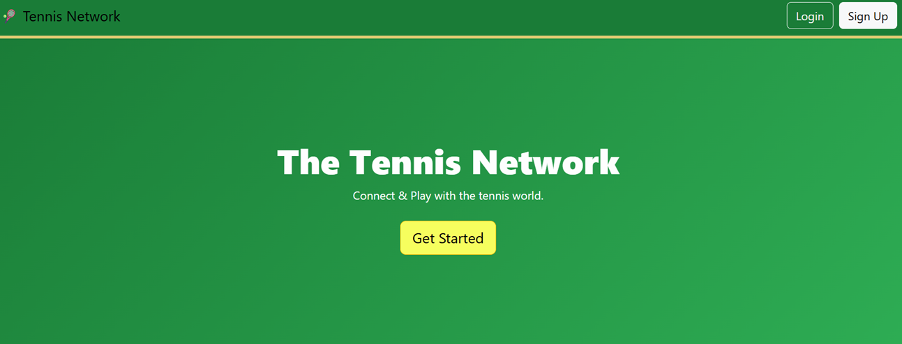
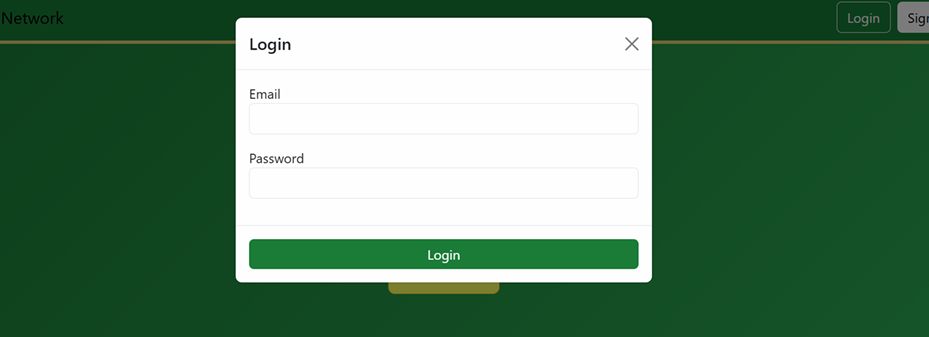
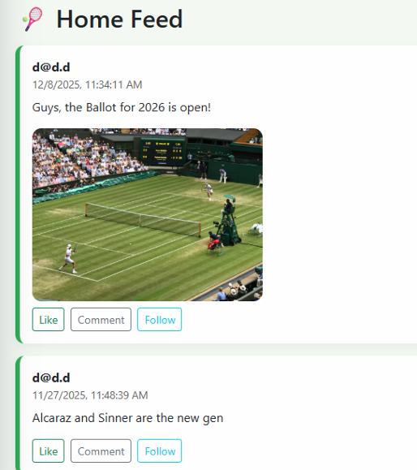
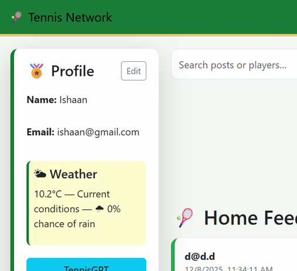
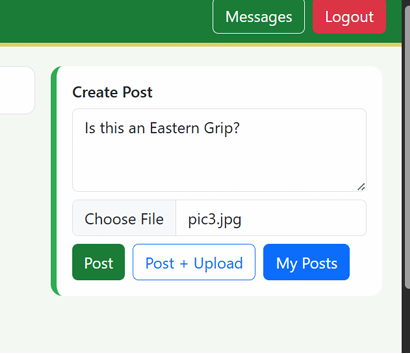
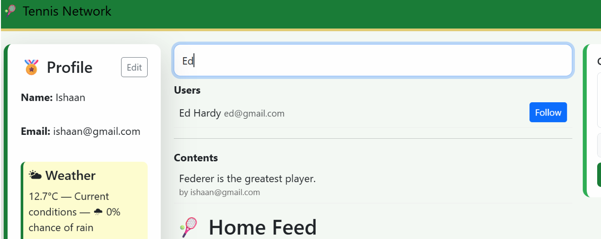
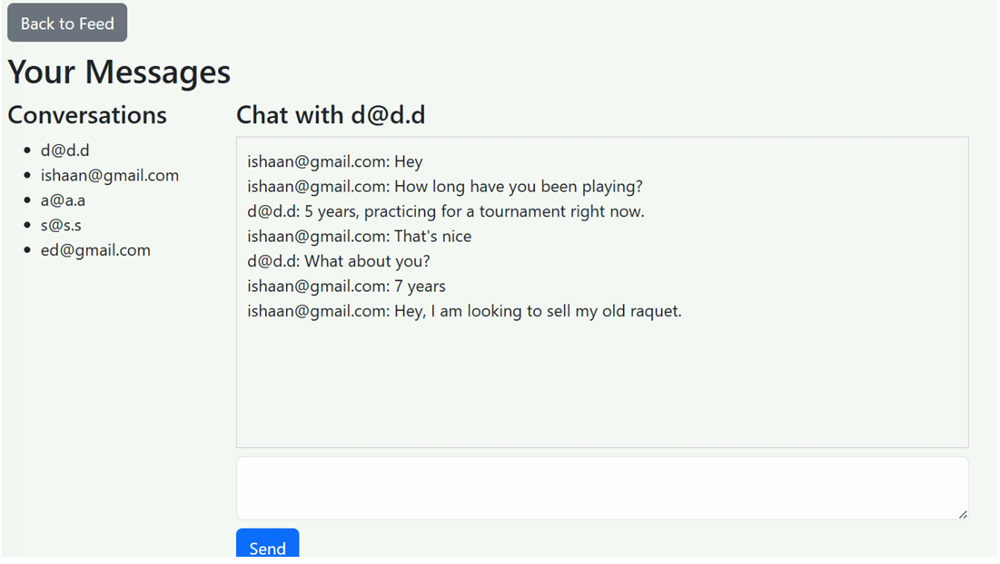

# The Tennis Network

The Tennis Network is a full-stack social networking web application designed for tennis players and fans to connect, share content, and communicate with each other.

Users can create accounts, follow other players, share posts, comment, like content, send private messages, and even interact with an AI-powered tennis assistant.

The platform combines modern frontend development with a powerful backend API and database system.

---

## Demo

Watch a walkthrough of the application:

[Project Demo Video](demo/tennis-network-demo.mp4)

---

## Screenshots

### Landing Page

### Login

### Home Feed

### Widgets/Sidebar

### Post Creation

### Search Bar

### Messaging System

---

## Features

- User registration and login authentication
- Social media style content posting
- Follow and unfollow users
- Like and comment on posts
- Personalised user feed
- Real-time messaging system
- Profile editing functionality
- Weather widget using Open-Meteo API
- AI Tennis assistant powered by Gemini API
- Image uploads for posts

---

## Tech Stack

Frontend
- HTML
- CSS
- JavaScript
- Bootstrap

Backend
- Node.js
- Express.js

Database
- MongoDB

APIs
- Open-Meteo Weather API
- Gemini AI API

---

## Running the Project Locally

To run this project on your own machine:

### 1. Clone the repository
git clone https://github.com/ishaanhari12/tennis-network.git

### 2. Navigate into the project folder
cd tennis-network

### 3. Install the required dependencies
npm install

### 4. Create a `.env` file in the root folder and add your Gemini API key
GEMINI_API_KEY=your_api_key_here

### 5. Start the server
node server.mjs

### 6. Open the application in your browser
http://localhost:3000

---

## Author

Developed by **Ishaan Hari**
